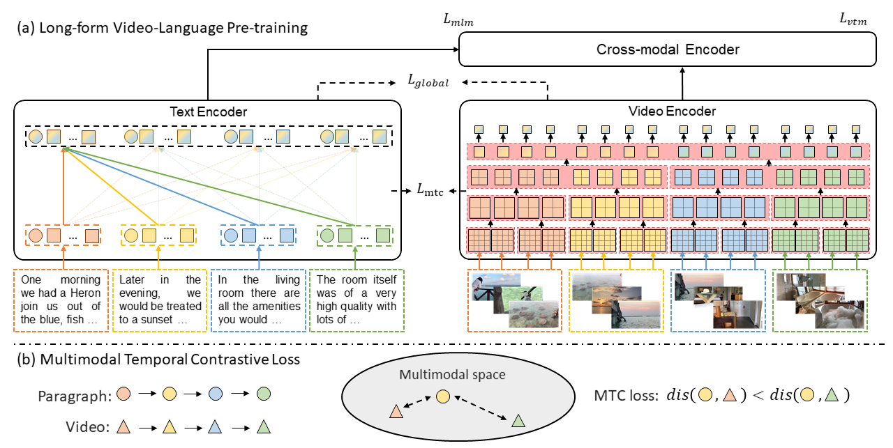

# LF-VILA

By [Yuchong Sun](https://ycsun1972.github.io), [Hongwei Xue](https://hellwayxue.github.io), [Ruihua Song](https://gsai.ruc.edu.cn/addons/teacher/index/info.html?user_id=0&ruccode=20200031&ln=en), [Bei Liu](https://www.microsoft.com/en-us/research/people/libei/), [Huan Yang](https://www.microsoft.com/en-us/research/people/huayan/), [Jianlong Fu](https://www.microsoft.com/en-us/research/people/jianf/).


The repo is the official implemenation of [Long-Form Video-Language Pre-Training with Multimodal Temporal Contrastive Learning](https://arxiv.org/abs/2210.06031), accepted by [NeurIPS 2022](https://nips.cc/Conferences/2022).

## Introdution
We introduce a **L**ong-**F**orm **VI**deo-**LA**nguage pre-training model (LF-VILA) and train it on a large-scale long-form video and paragraph dataset constructed from [HD-VILA-100M](https://github.com/microsoft/XPretrain/tree/main/hd-vila-100m). 

We propose a **Multimodal Temporal Contrastive (MTC)** loss to learn the temporal relation across different modalities by encouraging fine-grained alignment between long-form videos and paragraphs. We then propose a **Hierarchical Temporal Window Attention (HTWA)** mechanism to effectively capture long-range dependency while reducing computational cost in Transformer.

We fine-tune the pre-trained LF-VILA model on seven downstream long-form video-language understanding tasks of paragraph-to-video retrieval and long-form video question-answering, and achieve new state-of-the-art performances. Specifically, our model achieves **16.1\%**  relative improvement on ActivityNet paragraph-to-video retrieval task and **2.4\%** on How2QA task, respectively.


<p align="center">

</p>
<p align="center">
<font size=2 color="gray">The framework of LF-VILA.</font>
</p>


## Getting Started

### Set up the environment

Create a folder that stores pretrained models, all the data, and results.

    ```bash
    PATH_TO_STORAGE=/path/to/your/data/
    ```

Clone this repo and launch the Docker container for running the experiments. 
If you want to pre-train on your own dataset, please prepare the environment with `deepspeed`. It is a better choice to use the pre-built docker image ` ycsun1972/azureml_docker:horovod_deepspeed_v2`. Or you can build from the [dockerfile](./docker/Dockerfile).

    ```bash
    # command to get into the container, docker image should be automatically pulled.
    cd LF-VILA
    source launch_container.sh $PATH_TO_STORAGE $NAME
    ```

### Prepare data and pretrained model

1. Use [scripts/download_data.sh](scripts/download_data.sh) to download our pretrained model. In stage-one pretraining, we load pre-trained Swin Transformer and BERT-large. Our scripts will also download these model weights.

2. The above script will also download the annotations for downstream tasks.

- For Pre-training dataset, please refer to [HD-VILA-100M](https://github.com/microsoft/XPretrain/blob/main/hd-vila-100m/README.md) to prepare pre-training data. Please download the annotations and videos, then put them to $PATH_TO_STORAGE/datasets/hdvila100m. Please process the annotations by keeping continuous clips with at least 4 clips and construct the LF-VILA-8M dataset with 8.5 million long-from videos and corresponding transcripts, the put the processed annotations to $PATH_TO_STORAGE/datasets/pretrain.

- For ActivityNet Retrieval, you can download the raw videos refer to the [official website](http://activity-net.org/download.html). We use the split as [collaborative-experts](https://github.com/albanie/collaborative-experts/tree/master/misc/datasets/activity-net). Please download the raw videos and put them to $PATH_TO_STORAGE/datasets/activitynet/actnet_video.

- For DiDeMo, the raw videos can be download from [LisaAnne/LocalizingMoments](https://github.com/LisaAnne/LocalizingMoments). We use the split as [collaborative-experts](https://github.com/albanie/collaborative-experts/tree/master/misc/datasets/didemo). 

- For ActivityNet QA, we use the videos the same as MSRVTT Retrieval task.

- For [Condensed Movie](https://github.com/m-bain/CondensedMovies-chall) and [QuerYD](https://www.robots.ox.ac.uk/~vgg/data/queryd/), [How2QA](https://github.com/ych133/How2R-and-How2QA), [VIOLIN](https://github.com/jimmy646/violin), [COIN](https://coin-dataset.github.io/), and [LVU](https://github.com/chaoyuaw/lvu), the raw videos can be downloaded according to the [official instructions]. We use the official split.

- To speed up data reading, we compresse the frame rate or decode the frame from the original video. We provide the processing code [here](https://github.com/microsoft/XPretrain/blob/main/hd-vila/scripts/process_raw_video).


### Pre-training

Our pre-training consists of two stages. Stage one trains the dual encoder. Then stage two trains the cross-modal Transformer. During stage two, the parameters in stage one are frozen.

For stage one:
```bash
#inside the container
deepspeed src/run_pretrain.py --distributed --blob_mount_dir /blob_mount --config src/configs/pretrain_stage1.yaml --deepspeed
``` 

For stage two:
```bash
#inside the container
deepspeed src/run_pretrain.py --distributed --blob_mount_dir /blob_mount --config src/configs/pretrain_stage2.yaml --deepspeed
``` 
Notice that replace the `stage1_model_weight` in pretrain_stage2 with your stage one path.


### Finetune the model for downstream tasks
Please replace the data path in [src/configs](src/configs) with your own data path.

1. Finetuning Retrieval.
    ```bash
    # inside the container
    deepspeed src/tasks/run_retrieval.py --distributed --blob_mount_dir /blob_mount  --config $CONFIG_PATH --deepspeed
    ```
    `$CONFIG_PATH` should be set to one of the .yaml config files available at [src/configs](src/configs) postfixed with `_ret.yaml`. For example, you can use `src/configs/actnet_ret.yaml` for ActivityNet retrieval.

2. Finetuning Video QA.
    ```bash
    # inside the container
    deepspeed src/tasks/run_qa.py --distributed --blob_mount_dir /blob_mount --config $CONFIG_PATH --deepspeed
    ```
    `$CONFIG_PATH` should be set to one of the .yaml config files available at [src/configs](src/configs) postfixed with `_qa.yaml`. For example, you can use `src/configs/actnet_qa.yaml` 
    for ActivityNet video QA.

3. Finetuning Video Classification.
    ```bash
    # inside the container
    deepspeed src/tasks/run_video_classification.py --distributed --blob_mount_dir /blob_mount  --config $CONFIG_PATH --deepspeed
    ```
    `$CONFIG_PATH` should be set to one of the .yaml config files available at [src/configs](src/configs) postfixed with `_cls.yaml`. For example, you can use `src/configs/coin_cls.yaml` 
    for COIN video classification.


## Citing LF-VILA

If you find the code and pre-trained models useful for your research, please consider citing our paper. :blush:

```bibtex
@inproceedings{sun2022long-form,
    title={Long-Form Video-Language Pre-Training with Multimodal Temporal Contrastive Learning},
    author={Sun, Yuchong and Xue, Hongwei and Song, Ruihua and Liu, Bei and Yang, Huan and Fu, Jianlong},
    booktitle={NeurIPS},
    year={2022}
}
```

## Acknowledgements
The code is based on [HD-VILA](https://github.com/microsoft/XPretrain/tree/main/hd-vila), [ClipBERT](https://github.com/jayleicn/ClipBERT), [FROZEN](https://github.com/m-bain/frozen-in-time), [Swin Transformer](https://github.com/microsoft/Swin-Transformer) and [Huggingface Transformers](https://github.com/huggingface/transformers), thanks to them! 
