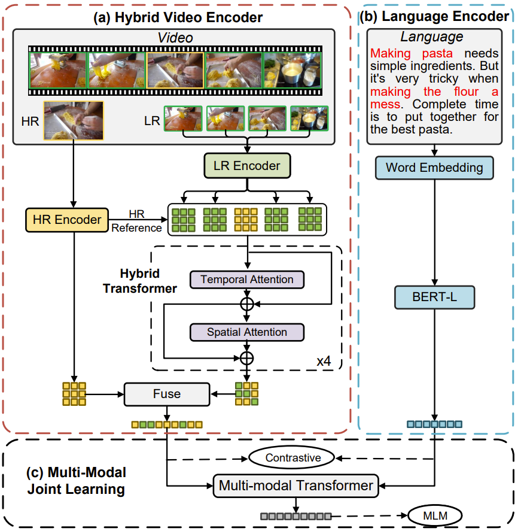

# HD-VILA

By [Hongwei Xue](https://hellwayxue.github.io/)\*, [Tiankai Hang](https://tiankaihang.github.io/)\*, [Yanhong Zeng](https://1900zyh.github.io/)\*, [Yuchong Sun](https://github.com/ycsun1972)\*, [Bei Liu](https://www.microsoft.com/en-us/research/people/libei/), [Huan Yang](https://www.microsoft.com/en-us/research/people/huayan/), [Jianlong Fu](https://www.microsoft.com/en-us/research/people/jianf/), and [Baining Guo](https://www.microsoft.com/en-us/research/people/bainguo/).


The repo is the official implemenation of ["Advancing High-Resolution Video-Language Representation with Large-Scale Video Transcriptions"](https://arxiv.org/abs/2111.10337).
It currently contains code and models for 

> Large-scale pre-training on [HD-VILA-100M](../hd-vila-100m/README.md)

> Downstream tasks including text to video retrieval, video question answering, and visual manipulation


## Introdution
We propose a novel **H**igh-resolution
and **D**iversified **VI**deo-**LA**nguage pre-training model (HD-VILA) for many visual tasks. 
To enable VL pre-training, we jointly
optimize the HD-VILA model by a hybrid Transformer
that learns rich spatiotemporal features, and a multimodal
Transformer that enforces interactions of the learned video
features with diversified texts. Our pre-training model
achieves new state-of-the-art results in **10** VL understanding tasks and **2** more novel text-to-visual generation tasks.
We outperform SOTA models with relative increases of 40.4% R@1 in zero-shot MSR-VTT text-to-video retrieval task, and 55.4% in high-resolution dataset LSMDC. The learned VL embedding is also effective in generating visually pleasing and semantically relevant results in text-to-visual editing and super-resolution tasks.

<p align="center">

</p>
<p align="center">
<font size=2 color="gray">The framework of HD-VILA.</font>
</p>

## Getting Started

The code and related instructions will be released soon. Thanks for your patience.

<!-- 
### Prepare dataset

For pre-training, xxx.

For VQA, xxx.

For retrieval, xxx.

### Install

- Clone this repo
```bash
git clone xxx
cd xxx/xxx
```

- If you want to pre-train on your own dataset, please prepare the environment with `horovod`. It is a better choice to use the pre-built docker image. Or you can build from the [dockerfile](./Dockerfile).

```
command to get into the container ...
```

### Training from scratch

### Finetune the model for downstream tasks

### Evaluation -->


## License

The license of the code and pre-trained models is [here](../LICENSE).

## Citing HD-VILA

If you find the code and pre-trained models useful for your research, please consider citing our paper. :blush:

```bibtex
@inproceedings{xue2022advancing,
    title={Advancing High-Resolution Video-Language Representation with Large-Scale Video Transcriptions},
    author={Xue, Hongwei and Hang, Tiankai and Zeng, Yanhong and Sun, Yuchong and Liu, Bei and Yang, Huan and Fu, Jianlong and Guo, Baining},
    booktitle={International Conference on Computer Vision and Pattern Recognition (CVPR)},
    year={2022}
}
```
