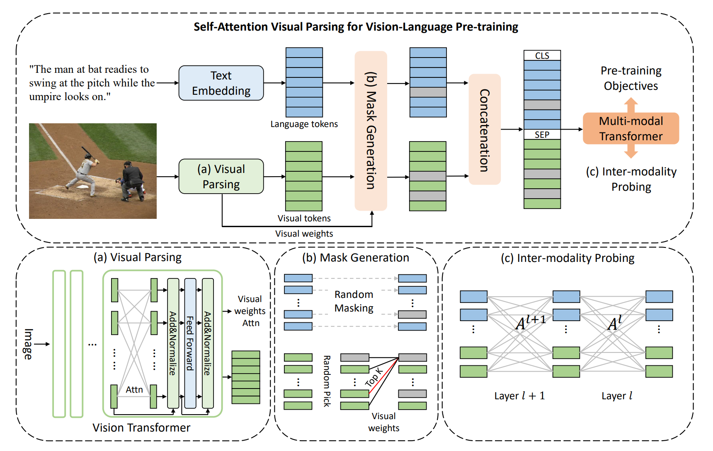

# Visual Parsing

[Probing Inter-modality: Visual Parsing with Self-Attention for Vision-and-Language Pre-training](https://proceedings.neurips.cc/paper/2021/file/23fa71cc32babb7b91130824466d25a5-Paper.pdf) accepted by [NeurIPS 2021](https://nips.cc/Conferences/2021/).

By [Hongwei Xue](https://hellwayxue.github.io/), [Yupan Huang](https://hypjudy.github.io/), [Bei Liu](https://www.microsoft.com/en-us/research/people/libei/), [Houwen Peng](https://www.microsoft.com/en-us/research/people/hopeng/), [Jianlong Fu](https://www.microsoft.com/en-us/research/people/jianf/), [Houqiang Li](http://staff.ustc.edu.cn/~lihq/en/), and [Jiebo Luo](https://www.cs.rochester.edu/u/jluo/).

## Introdution

We propose a fully Transformer visual embedding for Vision-Language Pre-training (VLP) to
better learn visual relation and further promote inter-modal alignment. Specifically,
we propose a metric named Inter-Modality Flow (IMF) to measure the interaction
between vision and language (i.e., inter-modality). We also design a novel masking
optimization mechanism named Masked Feature Regression (MFR) in Transformer
to further promote the inter-modality learning.

<p align="center">

</p>
<p align="center">
<font size=2 color="gray">The framework of Visual Parsing.</font>
</p>

## Citing Our Paper

If you find our work useful for your research, please consider citing our paper. :blush:

```bibtex
@article{xue2021probing,
  title={Probing Inter-modality: Visual Parsing with Self-Attention for Vision-and-Language Pre-training},
  author={Xue, Hongwei and Huang, Yupan and Liu, Bei and Peng, Houwen and Fu, Jianlong and Li, Houqiang and Luo, Jiebo},
  journal={Advances in Neural Information Processing Systems},
  volume={34},
  year={2021}
}
```
